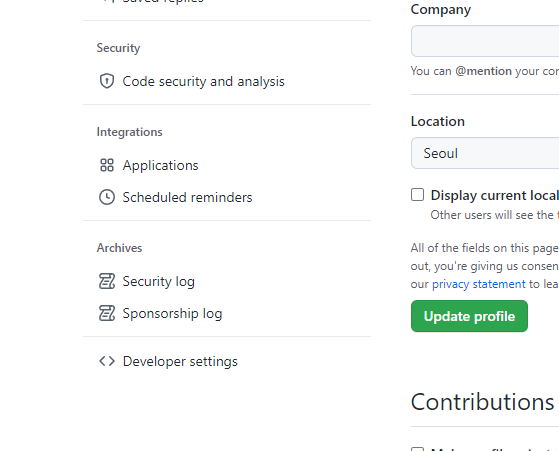

# Github Repo 등록

* Cloud9 콘솔에 접속하여 아래 명령어를 실행하시면 기본 스켈레톤 React 프로젝트가 생성됩니다.

```
cd /home/ec2-user/environment
npx create-react-app aws-react-sample
```

<figure><figcaption></figcaption></figure>


<figure><figcaption></figcaption></figure>

<figure><figcaption></figcaption></figure>

<figure><figcaption></figcaption></figure>

```
cd /home/ec2-user/environment/aws-react-sample

git remote add origin https://github.com/{yourGithubId}/aws-react-sample.git
git branch -M main
git push -u origin main
```

user/ password 기입


